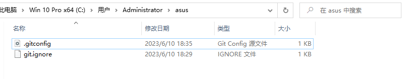
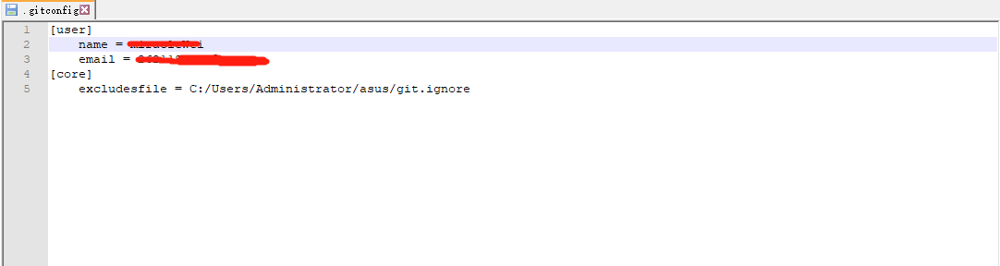
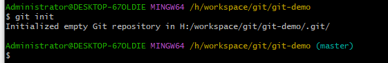
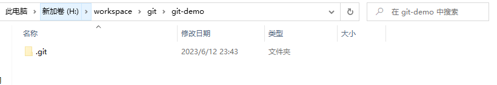
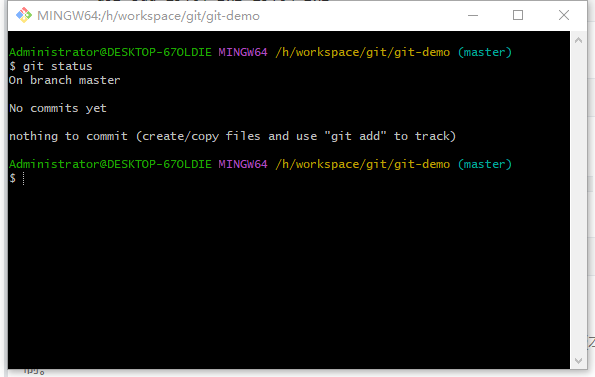
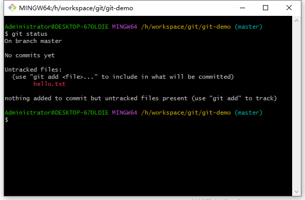
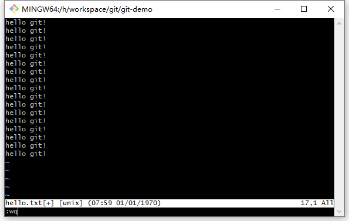
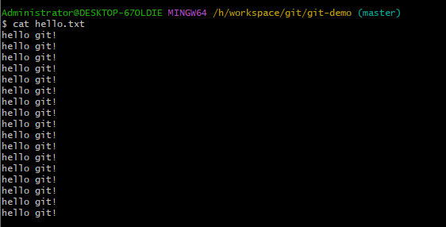
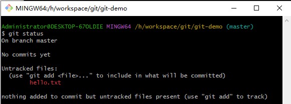

## Git常用命令


### 设置用户签名

``` lua
git config --global user.name miraclxxx
git config --global user.email 262xxxxxxqq.com
```







> 在Git中设置用户签名是为了在提交代码时标识出作者的身份。要设置用户签名，需要配置两个参数：用户名和电子邮件地址。可以按照以下步骤进行设置：
>
> 1. 打开命令行或终端。
>
> 2. 执行以下命令，将你的用户名配置到Git中：
>
>    ```lua
>    git config --global user.name "Your Name"
>    ```
>
>    将 "Your Name" 替换为你想要显示的用户名。
>
> 3. 执行以下命令，将你的电子邮件地址配置到Git中：
>
>    ```lua
>    执行以下命令，将你的电子邮件地址配置到Git中：
>    ```
>
>    将 "[your.email@example.com](mailto:your.email@example.com)" 替换为你的实际电子邮件地址。
>
> 这样，你就成功地设置了全局的用户签名。Git会在你进行代码提交时使用这些配置的用户名和电子邮件地址。
>
> 你也可以在特定的仓库中针对该仓库配置不同的用户签名，只需在对应的仓库目录下执行上述命令，并去掉 `--global` 参数即可。
>
> 你可以使用以下命令来验证你的设置是否正确：
>
> ```lua
> git config --global user.name
> git config --global user.email
> ```
>
> 这将显示你配置的用户名和电子邮件地址。
>
> 注意：设置用户签名是可选的，但在多人协作的项目中，使用真实的用户名和电子邮件地址是推荐的，以便更好地跟踪代码的贡献者和维护历史记录。


### 初始化本地库

``` lua
git init
```






> 要初始化一个本地Git仓库，你可以按照以下步骤操作：
>
> 1. 打开命令行或终端。
>
> 2. 切换到你想要创建仓库的目录。可以使用 `cd` 命令来导航到目标目录。例如：
>
>    ```lua
>    cd /path/to/repository
>    ```
>
> 3. 执行以下命令来初始化一个空的Git仓库：
>
>    ```lua
>    git init
>    ```
>
>    这将在当前目录下创建一个新的Git仓库，并在目录中生成一个 `.git` 子目录，该目录包含Git的版本控制相关信息。
>
> 4. 现在，你的本地仓库已经初始化完成。你可以开始添加文件、进行提交等操作。
>
>    - 使用 `git add` 命令将你要跟踪的文件添加到Git的暂存区。例如：
>
>      ```lua
>      git add file1.txt file2.txt
>      ```
>
>    - 使用 `git commit` 命令将暂存区中的更改提交到仓库。例如：
>
>      ```lua
>      git commit -m "Initial commit"
>      ```
>
>    在添加和提交文件后，你的本地仓库就包含了相应的文件和历史记录。
>
> 如果你想将本地仓库与远程仓库关联，以便备份、共享和协作，你可以使用 `git remote add` 命令添加一个远程仓库的链接。例如：
>
> ```lua
> git remote add origin <远程仓库URL>
> ```
>
> 将 `<远程仓库URL>` 替换为你的远程仓库的URL。
>
> 这样，你就成功初始化了一个本地Git仓库，并可以在该仓库中进行代码管理和版本控制。


### 查看状态

``` lua
git status
// master 分支
On branch master
// 没有提交过文件
No commits yet
// 没有文件需要提交
nothing to commit (create/copy files and use "git add" to track)
```



```lua
$ git status
// master 分支
On branch master
// 没有提交过文件
No commits yet
// hello.txt 未被追踪的文件
Untracked files:
  (use "git add <file>..." to include in what will be committed)
        hello.txt

nothing added to commit but untracked files present (use "git add" to track)
```




#### 添加hello.txt文件

>创建一个 `hello.txt` 文件
>
>``` lua
>vim hello.txt
>
>i
>
>hello git!
>
>esc
>
>yy
>
>p
>
>:wq
>
>cat hello.txt
>```
>
>
>
>


#### git status 详细

>在Git中，可以使用 `git status` 命令来查看当前仓库的状态。执行该命令会显示与仓库相关的一些信息，包括已修改但未提交的文件、已添加到暂存区但未提交的文件以及仓库的当前分支状态等。
>
>要查看仓库的状态，请按照以下步骤操作：
>
>1. 打开命令行或终端。
>
>2. 导航到你的Git仓库目录。可以使用 `cd` 命令来切换到仓库所在的目录。
>
>3. 在目标目录下执行以下命令：
>
>   ```lua
>   git status
>   ```
>
>   执行命令后，Git会显示当前仓库的状态信息。
>
>Git状态信息中的一些常见项包括：
>
>- "On branch <branch name>"：显示当前所在的分支。
>- "Changes not staged for commit"：列出已修改但未添加到暂存区的文件。
>- "Changes to be committed"：列出已添加到暂存区但未提交的文件。
>- "Untracked files"：列出未被Git跟踪的文件。
>
>
>
>通过查看状态信息，你可以了解当前仓库的修改情况，以及哪些文件已经添加到暂存区或提交到仓库中。
>
>请注意，执行 `git status` 不会对仓库产生任何修改，它只是提供了仓库的当前状态信息。如果你想要提交更改或执行其他操作，请使用相应的Git命令，如 `git add` 和 `git commit`。


