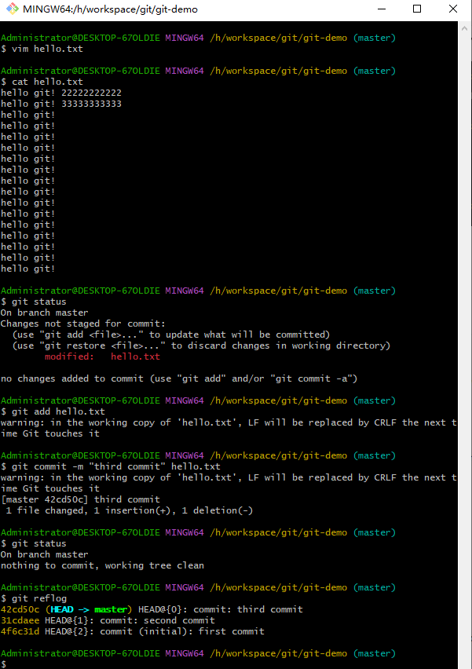

## Git常用命令


### 设置用户签名

``` lua
git config --global user.name miraclxxx
git config --global user.email 262xxxxxxqq.com
```


> 在Git中设置用户签名是为了在提交代码时标识出作者的身份。要设置用户签名，需要配置两个参数：用户名和电子邮件地址。可以按照以下步骤进行设置：
>
> 1. 打开命令行或终端。
>
> 2. 执行以下命令，将你的用户名配置到Git中：
>
>    ```lua
>    git config --global user.name "Your Name"
>    ```
>
>    将 "Your Name" 替换为你想要显示的用户名。
>
> 3. 执行以下命令，将你的电子邮件地址配置到Git中：
>
>    ```lua
>    执行以下命令，将你的电子邮件地址配置到Git中：
>    ```
>
>    将 "[your.email@example.com](mailto:your.email@example.com)" 替换为你的实际电子邮件地址。
>
> 这样，你就成功地设置了全局的用户签名。Git会在你进行代码提交时使用这些配置的用户名和电子邮件地址。
>
> 你也可以在特定的仓库中针对该仓库配置不同的用户签名，只需在对应的仓库目录下执行上述命令，并去掉 `--global` 参数即可。
>
> 你可以使用以下命令来验证你的设置是否正确：
>
> ```lua
> git config --global user.name
> git config --global user.email
> ```
>
> 这将显示你配置的用户名和电子邮件地址。
>
> 注意：设置用户签名是可选的，但在多人协作的项目中，使用真实的用户名和电子邮件地址是推荐的，以便更好地跟踪代码的贡献者和维护历史记录。


### 初始化本地库

``` lua
git init
```


> 要初始化一个本地Git仓库，你可以按照以下步骤操作：
>
> 1. 打开命令行或终端。
>
> 2. 切换到你想要创建仓库的目录。可以使用 `cd` 命令来导航到目标目录。例如：
>
>    ```lua
>    cd /path/to/repository
>    ```
>
> 3. 执行以下命令来初始化一个空的Git仓库：
>
>    ```lua
>    git init
>    ```
>
>    这将在当前目录下创建一个新的Git仓库，并在目录中生成一个 `.git` 子目录，该目录包含Git的版本控制相关信息。
>
> 4. 现在，你的本地仓库已经初始化完成。你可以开始添加文件、进行提交等操作。
>
>    - 使用 `git add` 命令将你要跟踪的文件添加到Git的暂存区。例如：
>
>      ```lua
>      git add file1.txt file2.txt
>      ```
>
>    - 使用 `git commit` 命令将暂存区中的更改提交到仓库。例如：
>
>      ```lua
>      git commit -m "Initial commit"
>      ```
>
>    在添加和提交文件后，你的本地仓库就包含了相应的文件和历史记录。
>
> 如果你想将本地仓库与远程仓库关联，以便备份、共享和协作，你可以使用 `git remote add` 命令添加一个远程仓库的链接。例如：
>
> ```lua
> git remote add origin <远程仓库URL>
> ```
>
> 将 `<远程仓库URL>` 替换为你的远程仓库的URL。
>
> 这样，你就成功初始化了一个本地Git仓库，并可以在该仓库中进行代码管理和版本控制。


### 查看本地库状态

``` lua
git status
// master 分支
On branch master
// 没有提交过文件
No commits yet
// 没有文件需要提交
nothing to commit (create/copy files and use "git add" to track)
```


```lua
$ git status
// master 分支
On branch master
// 没有提交过文件
No commits yet
// hello.txt 未被追踪的文件
Untracked files:
  (use "git add <file>..." to include in what will be committed)
        hello.txt

nothing added to commit but untracked files present (use "git add" to track)
```


#### 添加hello.txt文件

>创建一个 `hello.txt` 文件
>
>``` lua
>vim hello.txt
>
>i
>
>hello git!
>
>esc
>
>yy
>
>p
>
>:wq
>
>cat hello.txt
>```
>
>
>
>


#### git status 详细

>在Git中，可以使用 `git status` 命令来查看当前仓库的状态。执行该命令会显示与仓库相关的一些信息，包括已修改但未提交的文件、已添加到暂存区但未提交的文件以及仓库的当前分支状态等。
>
>要查看仓库的状态，请按照以下步骤操作：
>
>1. 打开命令行或终端。
>
>2. 导航到你的Git仓库目录。可以使用 `cd` 命令来切换到仓库所在的目录。
>
>3. 在目标目录下执行以下命令：
>
>   ```lua
>   git status
>   ```
>
>   执行命令后，Git会显示当前仓库的状态信息。
>
>Git状态信息中的一些常见项包括：
>
>- "On branch <branch name>"：显示当前所在的分支。
>- "Changes not staged for commit"：列出已修改但未添加到暂存区的文件。
>- "Changes to be committed"：列出已添加到暂存区但未提交的文件。
>- "Untracked files"：列出未被Git跟踪的文件。
>
>
>
>通过查看状态信息，你可以了解当前仓库的修改情况，以及哪些文件已经添加到暂存区或提交到仓库中。
>
>请注意，执行 `git status` 不会对仓库产生任何修改，它只是提供了仓库的当前状态信息。如果你想要提交更改或执行其他操作，请使用相应的Git命令，如 `git add` 和 `git commit`。


### 添加暂存区

> git add 添加暂存区

``` lua
git add hello.txt
```


> WARNING
> 该警告信息是由于行尾换行符（Line Ending）的差异引起的。在不同的操作系统中，行尾换行符的表示方式可能不同：Windows使用回车换行（CRLF，\r\n），而Unix/Linux使用换行（LF，\n）。
>
> 当你执行`git add`命令时，Git会根据你的配置自动调整行尾换行符以符合仓库的配置。在你的情况下，Git发现`hello.txt`文件的行尾换行符是LF（Unix风格），但根据Git的配置，它将被替换为CRLF（Windows风格）。
>
> 该警告本身不会影响你的代码或Git仓库的功能。它只是提醒你在Git操作期间会发生换行符的调整。


> git rm --cached  删除暂存区

``` lua
git rm --cached hello.txt
```


> git rm 从暂存区和工作目录中删除它

执行命令`git rm --cached hello.txt`将从Git的暂存区中移除`hello.txt`文件。这意味着该文件将不再被Git跟踪，但会保留在你的工作目录中。

输出信息`rm 'hello.txt'`表示成功将`hello.txt`文件从暂存区中移除。但请注意，该文件仍然存在于你的工作目录中。

如果你希望完全从版本控制中移除`hello.txt`文件，包括从暂存区和工作目录中删除它，可以执行以下命令：

```lua
git rm hello.txt
```

这将从Git中删除该文件，并且会同时从暂存区和工作目录中删除它。执行该命令后，文件将不再被Git跟踪。

请注意，在执行`git rm`命令之后，确保使用`git commit`命令提交更改，以将删除操作记录到Git的历史记录中。


### 提交本地库

#### git commit

> git commit -m "日志信息" 文件名

```lua
$ git commit -m "first commit" hello.txt
warning: in the working copy of 'hello.txt', LF will be replaced by CRLF the next t
ime Git touches it
[master (root-commit) 4f6c31d] first commit
 1 file changed, 17 insertions(+)
 create mode 100644 hello.txt
```


> 输出信息 "[master (root-commit) 4f6c31d] first commit" 表示提交成功。其中，"master" 表示你当前所在的分支名（可能是默认的主分支），"4f6c31d" 是提交的哈希值，用于唯一标识该提交。
>
> "1 file changed, 17 insertions(+)" 表示有一个文件发生了变化，其中插入了17行内容。
>
> "create mode 100644 hello.txt" 表示成功创建了 "hello.txt" 文件，并设置了文件的权限为 100644。
>
> 现在，你的第一次提交已经完成，并且文件 "hello.txt" 已经被添加到了Git仓库中。你可以继续进行后续的开发和提交操作。


#### 查看状态（没有文件需要提交）

``` lua
$ git status
On branch master
nothing to commit, working tree clean
```


> 输出信息 "On branch master" 表示你当前位于主分支（master）。
>
> "nothing to commit, working tree clean" 表示没有需要提交的更改，并且工作目录是干净的。这意味着你的代码与最近的提交记录保持一致，没有未提交的修改。


### 修改文件

#### 查看状态（检测到工作区有文件被修改）

``` lua
# 打开hello.txt文件
vim hello.txt
# 编辑模式
i
#修改内容
hello git! 22222222222
# 退出编辑
esc
# 保存并退出文件
：wq
```


``` lua
$ git status
On branch master
Changes not staged for commit:
  (use "git add <file>..." to update what will be committed)
  (use "git restore <file>..." to discard changes in working directory)
        modified:   hello.txt

no changes added to commit (use "git add" and/or "git commit -a")
```


#### 将修改的文件再次添加暂存区

```lua
# 添加暂存区
$ git add hello.txt
warning: in the working copy of 'hello.txt', LF will be replaced by CRLF the next t
ime Git touches it
# 查看状态
$ git status
On branch master
Changes to be committed:
  (use "git restore --staged <file>..." to unstage)
        modified:   hello.txt
```


#### 查看状态（工作区的修改添加到了暂存区）


``` lua
# 提交本地库
$ git commit -m "second commit" hello.txt
warning: in the working copy of 'hello.txt', LF will be replaced by CRLF the next t
ime Git touches it
[master 31cdaee] second commit
 1 file changed, 1 insertion(+), 1 deletion(-)

# 查看状态
$ git status
On branch master
nothing to commit, working tree clean

# 查看日志
$ git reflog
31cdaee (HEAD -> master) HEAD@{0}: commit: second commit
4f6c31d HEAD@{1}: commit (initial): first commit

```


> 第三次提交




### 历史版本

#### git reflog

``` lua
$ git reflog
4f6c31d (HEAD -> master) HEAD@{0}: commit (initial): first commit
```


> `git reflog` 命令用于查看Git仓库的引用日志（reflog）。引用日志记录了Git仓库中引用（如分支、HEAD）的历史变动，包括分支切换、提交、合并等操作。
>
> 在你的输出中，`4f6c31d` 是提交的哈希值，表示 "first commit" 的提交记录。`(HEAD -> master)` 表示当前所在的分支是主分支（master）。`HEAD@{0}` 表示当前的引用位置，即最新的引用。
>
> 整个输出表示你的Git仓库中只有一次提交记录，即初始提交 "first commit"，对应的哈希值是 `4f6c31d`。
>
> 通过 `git reflog` 命令，你可以查看Git仓库中的引用变动历史，包括分支切换、提交和重置等操作。这对于恢复误操作、查找丢失的提交或回滚代码等情况非常有用。


#### git log

``` lua
$ git log
commit 4f6c31da8481c5dccadd0a36fdd8ff71307c9b20 (HEAD -> master)
Author: miracleWei <2621181694@qq.com>
Date:   Tue Jun 13 22:13:31 2023 +0800

    first commit
```


> `git log` 命令用于显示Git仓库中的提交记录历史。在你的输出中，有一条提交记录的信息如下：
>
> ```lua
> commit 4f6c31da8481c5dccadd0a36fdd8ff71307c9b20 (HEAD -> master)
> Author: miracleWei <2621181694@qq.com>
> Date:   Tue Jun 13 22:13:31 2023 +0800
> 
>     first commit
> ```
>
> 这里是对该提交的解释：
>
> - `commit 4f6c31da8481c5dccadd0a36fdd8ff71307c9b20`：这是提交的哈希值，用于唯一标识该提交。
> - `(HEAD -> master)`：表示当前所在的分支是主分支（master），HEAD指向该分支。
> - `Author: miracleWei <2621181694@qq.com>`：提交的作者信息，包括作者的名称和电子邮件地址。
> - `Date: Tue Jun 13 22:13:31 2023 +0800`：提交的日期和时间信息。
> - `first commit`：提交的注释或消息，描述了该次提交的内容。
>
> 通过 `git log` 命令，你可以查看Git仓库中的提交记录，并了解每个提交的详细信息，包括作者、日期、注释等。这对于追踪代码变更、查找特定提交或了解项目的演化非常有用。


#### 版本穿梭 git reset

``` lua
git reset --hard <版本号>
```


当前在master分支下

H:\workspace\git\git-demo\.git


master分支下的版本：31cdaeef4d8a4239687de43184cb61e3add41a01

H:\workspace\git\git-demo\.git\refs\heads


#### 获取当前版本号

``` lua
git rev-parse HEAD
```


## Git 分支


### 分支简介

在Git中，分支（Branch）是用于独立开发特性、修复问题或进行实验的独立线路。它允许你在不影响主线（通常是主分支）的情况下进行并行开发。

使用Git分支可以实现以下目的：

1. 并行开发：你可以基于主分支创建新的分支，每个分支可以独立开发不同的功能或解决不同的问题。这样可以防止不同功能之间的代码冲突，并允许团队成员同时进行工作。
2. 版本控制：每个分支都可以保留一组特定的提交记录，这样你可以根据需要切换到不同的分支，查看和回滚特定的版本。

以下是一些常见的Git分支操作：

- 创建分支：使用 `git branch <branch-name>` 命令创建一个新的分支。例如，`git branch feature` 将创建一个名为 "feature" 的分支。
- 切换分支：使用 `git checkout <branch-name>` 命令切换到指定的分支。例如，`git checkout feature` 将切换到名为 "feature" 的分支。
- 创建并切换分支：使用 `git checkout -b <branch-name>` 命令可以一次性创建新的分支并切换到该分支。例如，`git checkout -b feature` 将创建并切换到名为 "feature" 的分支。
- 查看分支：使用 `git branch` 命令可以列出所有的分支，并在当前分支前面标记一个星号（*）。当前所在的分支会以绿色显示。
- 合并分支：使用 `git merge <branch-name>` 命令将指定分支的更改合并到当前分支。例如，如果在主分支上执行 `git merge feature`，则将 "feature" 分支的更改合并到主分支。
- 删除分支：使用 `git branch -d <branch-name>` 命令删除指定的分支。请注意，只有当该分支的更改已经合并到其他分支中时，才能删除分支。

这些是Git中分支操作的一些基本命令。通过使用这些命令，你可以创建、切换、合并和删除分支，以适应不同的开发需求和工作流程。


### 分支操作


#### 查看分支


#### 创建分支


#### 修改分支


#### 切换分支


#### 合并分支


#### 产生冲突


#### 解决冲突


